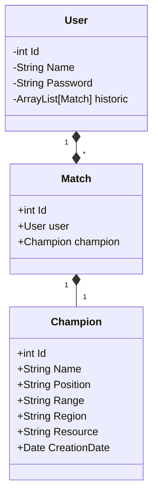

```mermaid
classDiagram
    
    Match "1" *-- "1" Champion
    User "1" *--* "*" Match


    class Match{
        +int Id
        +User user
        +Champion champion
    
    }

    class Champion{
        +int Id
        +String Name
        +String Position
        +String Range
        +String Region
        +String Resource
        +Date CreationDate 
    }

    class User{
      -int Id
      -String Name
      -String Password
      -ArrayList[Match] historic
    }
```